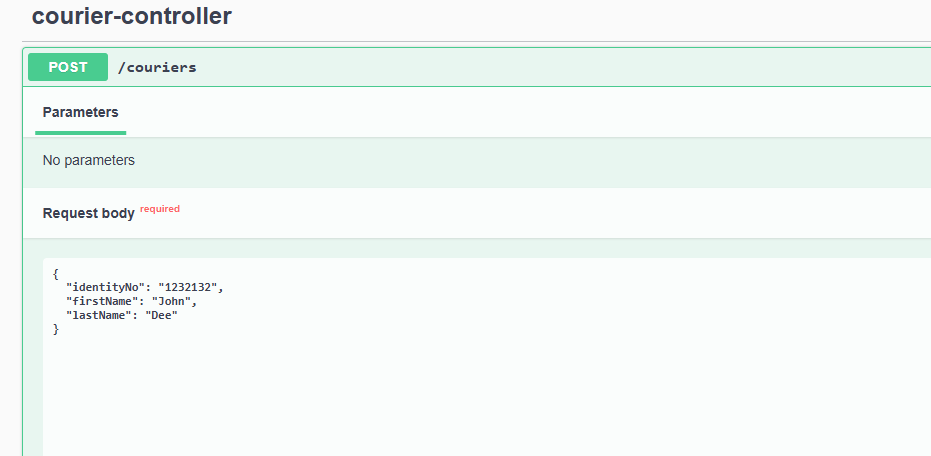
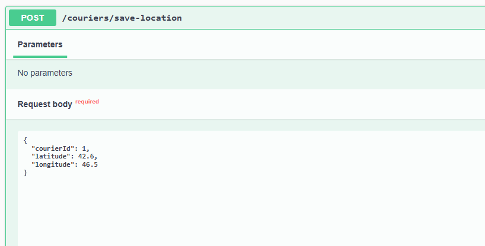
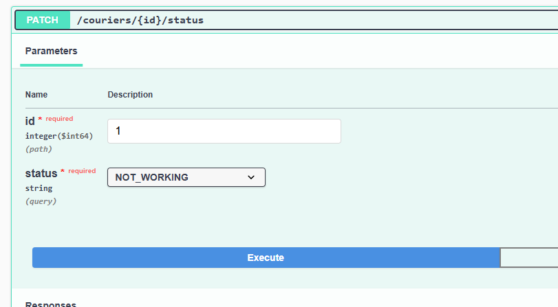

# courier-tracking-project

The main technologies I used in the courier tracking system project are listed below.

## Technologies Used

* Java 17
* Springboot 3
* Feign Client
* Apache Kafka
* Swagger
* PostgreSQL
* Mongodb
* Docker
* Mapstruct

## Architecture Diagram


## Running on Your Computer

Navigate to the project directory in the terminal

```bash
  cd courier-tracking-project
```

* The docker-compose.yml file contains configurations for Kafka, PostgreSql, Mongodb, Zookeeper.

You can start these tools with the following command:

```docker
  docker-compose up -d
```

## Let's run the application step by step on Swagger and see the flow.

* First, let's run courier service, order service and store proximity service on your local.

### Create Courier Example

* __Courier service__ : <http://localhost:8082/swagger-ui/index.html#/>

```json
{
  "identityNo": "12342323423",
  "firstName": "courier1",
  "lastName": "test"
}
```



### Save Location Example

* __Courier service__ : <http://localhost:8082/swagger-ui/index.html#/>

```json
{
  "courierId": 1,
  "latitude": 42.6,
  "longitude": 46.5
}
```



### Update Status Example

* __Courier service__ : <http://localhost:8082/swagger-ui/index.html#/>





### Get Total Distance

```json
{
  "courierId": 101,
  "startDate": "2025-05-10",
  "endDate": "2025-05-12"
}
```


